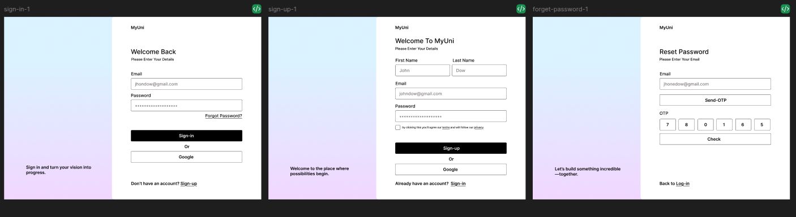
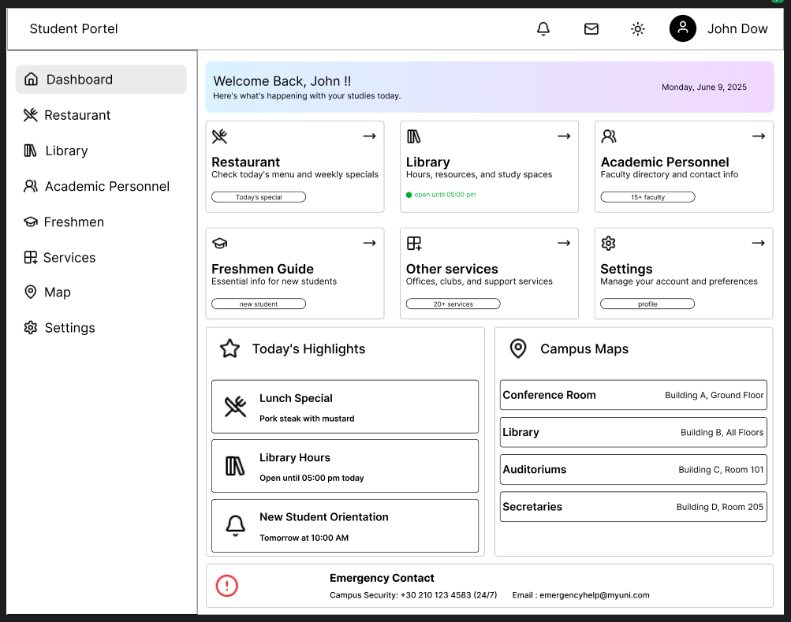
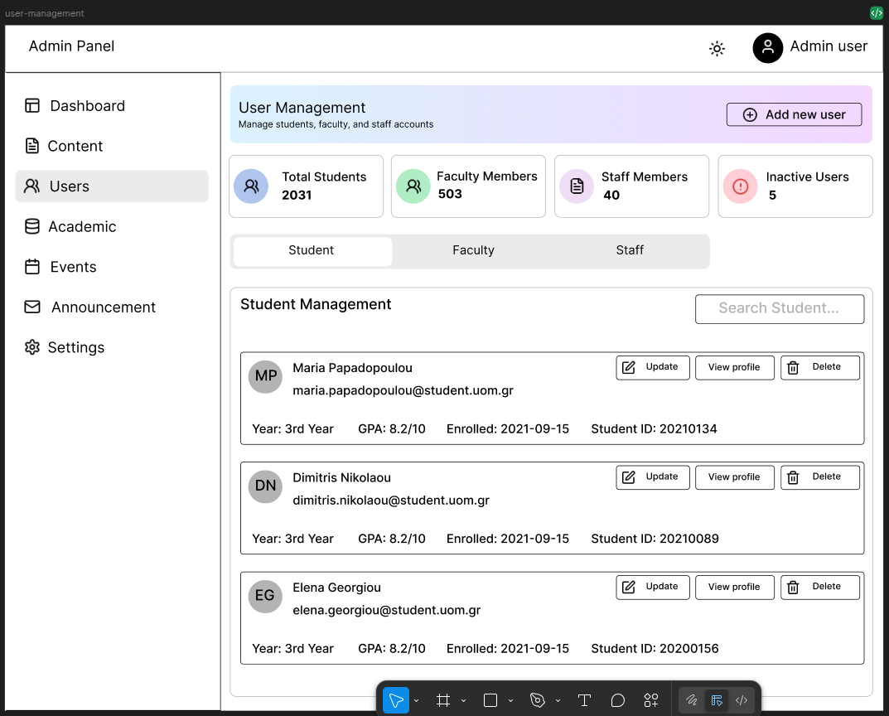

    <h1 align="center">
        Open Technologies Alliance - GFOSS | MyUni
    </h1>
    <h2 align="center">
        Final Work Report for Google Summer of Code 2025 under  <b>Open Technologies Alliance - GFOSS</b> for the <strong>MyUni</strong> project
    </h2>
    

        
        &nbsp;&nbsp;&nbsp;&nbsp;&nbsp;&nbsp;&nbsp;&nbsp;&nbsp;&nbsp;&nbsp;&nbsp;&nbsp;&nbsp;&nbsp;&nbsp;
    

    <h2> Contributor Info </h2>
    

        <table>
            <tr>
                <td width="50%">
                    <h5>&#8226; Name - Adil Kadival </h5> 
                    <h5>&#8226; Organization - <a href="https://github.com/open-source-uom" target="_blank">Open Source UoM (GFOSS)</a> </h5> 
                    <h5>&#8226; Email - <a href="mailto:adilkadivala560@gmail.com" target="_blank">adilkadivala560@gmail.com</a> </h5> 
                    <h5>&#8226; GitHub - <a href="https://github.com/adilkadivala" target="_blank">Adil Kadivala</a></h5> 
                    <h5>&#8226; LinkedIn - <a href="https://www.linkedin.com/in/adilkadivala" target="_blank">Adil Kadival</a></h5> 
                    <h5>&#8226; Twitter - <a href="https://x.com/adil_kadival" target="_blank">adil_kadival</a></h5>
                </td>
                <td width="950px">
                
                </td>
            </tr>
        </table>
    

    <h2> Mentors' Info </h2>
    

        <h5>&#8226; Mentor - <a href="https://github.com/Tsalmas-Anastasios" target="_blank">Tsalmas Anastasios</a></h5>
        <h5>&#8226; Mentor - <a href="https://github.com/iosifidis" target="_blank">Efstathios Iosifidis</a></h5>
        <h5>&#8226; Assisting Mentor - <a href="https://github.com/dimsparagis0210" target="_blank">Dimitris Sparagis</a></h5>
    

     

<h2 align="center"> Project Details </h2>

The **MyUni** project is *a complete university student and faculty management platform*. It is a unified, open-source solution designed to modernize and extend the current MyUoM app for Greek universities.  

During GSoC 2025, I worked on three repositories, all fully responsive and supporting both light and dark themes:

- **myuni-backend**
- **myuni-frontend-admin**
- **myuni-frontend-student**

### myuni-backend
The backend repository contains all server-side logic for both the student and admin portals. I implemented a robust authentication system, scalable backend architecture, and real-time data synchronization using modern technologies such as **Express.js, TypeScript, Prisma ORM, Redis, and Email services**.  

### myuni-frontend-admin
The admin portal enables administrators to manage academic information, announcements, and events. Admins can view and manage all users by role and easily control the CMS through a clean UI.  

### myuni-frontend-student
The student portal allows students to view their academic information, announcements, and events. Additionally, it provides a **drag-and-drop website builder** that empowers students to create personalized websites with minimal effort.  

 

## GSoC Project Page
- [GSoC 2025 with Open Technologies Alliance - GFOSS - MyUni](https://summerofcode.withgoogle.com/programs/2025/projects/tz6ymx0o)

## GSoC Project Proposal
- [Project Proposal](https://github.com/adilkadivala/GSoC-2025/blob/main/proposal.pdf)

## Project Repository | Organization Page
- [Open Source UoM](https://github.com/open-source-uom)

## GSoC Blogs
- [My GSoC journey has started](https://dub.sh/midterm-end)  
- [From Dreamer to Contributor](https://dub.sh/dreamTocontribut)  
- [GSoC Midterm](https://dub.sh/gsoc-midterm)  
- [GSoC Midterm-End](https://dub.sh/midterm-end)  

 

## Work Summary

### **1. Creating the Figma Designs**
At the initial stage, I designed layouts for **myuni-frontend-student** and **myuni-frontend-admin**. I focused on modern, accessible, and responsive designs for all devices.  

**Auth Pages**

**Student Portal Layout**

**Admin Portal Layout**

---

### **2. Developing Frontend for Student and Admin**
After finalizing designs and mentor feedback, I started developing the portals using **React (Vite) with TypeScript**, **ShadCN**, and **Tailwind CSS**. I followed best practices for reusability and structure.  

- **Error Boundary**: Initially, if one component broke, it crashed the whole app. I solved this by implementing error boundaries so that only the faulty component fails while the rest of the app continues working.  

---

### **3. Developing Backend for Student and Admin**
Once the frontend was functional, I moved to backend development. This was my first time working with an **OOP-based project template**, which was challenging at first but became a great learning experience thanks to my mentors’ guidance.  

The backend was built with **Express.js, TypeScript, PostgreSQL, and Prisma ORM**, with **Redis for caching**. I tested all APIs using Postman and successfully integrated them with the frontend.  

Additional backend work included:  
- **Implementing CI/CD pipelines**  
- **Building Docker images**  
- **Deploying on AWS EC2**  

## **Conclusion**
Overall, my work on the MyUni project during GSoC 2025 included **design, development, testing, deployment, and documentation**. I began with Figma designs, implemented both student and admin portals, built and optimized backend services, and ensured smooth integration across the system.  

This experience strengthened my technical expertise in full-stack development, DevOps practices, and collaborative open-source workflows. It also gave me a deeper understanding of designing scalable systems that can serve diverse institutions.  

Going forward, I plan to continue contributing to MyUni by:  
- Expanding features like analytics and advanced personalization.  
- Improving test coverage and documentation for easier onboarding.  
- Supporting other universities in adopting and customizing the platform.  
- Mentoring future contributors who wish to participate in GSoC.  

This journey has been a milestone in my open-source career, and I look forward to helping MyUni grow into a truly national platform for Greek universities.  
